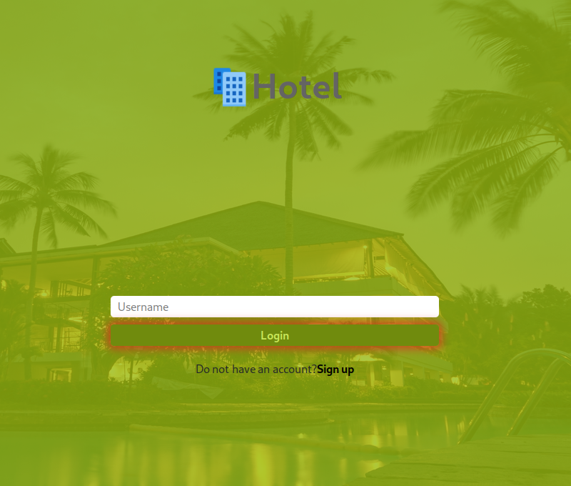
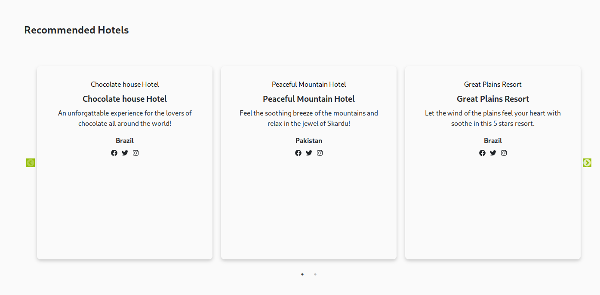
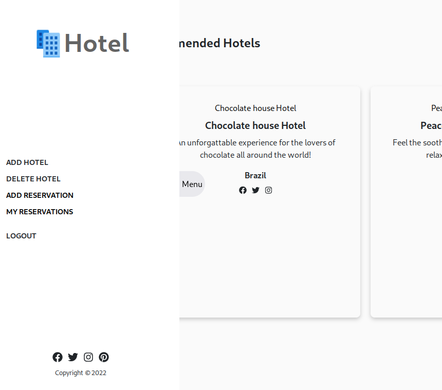
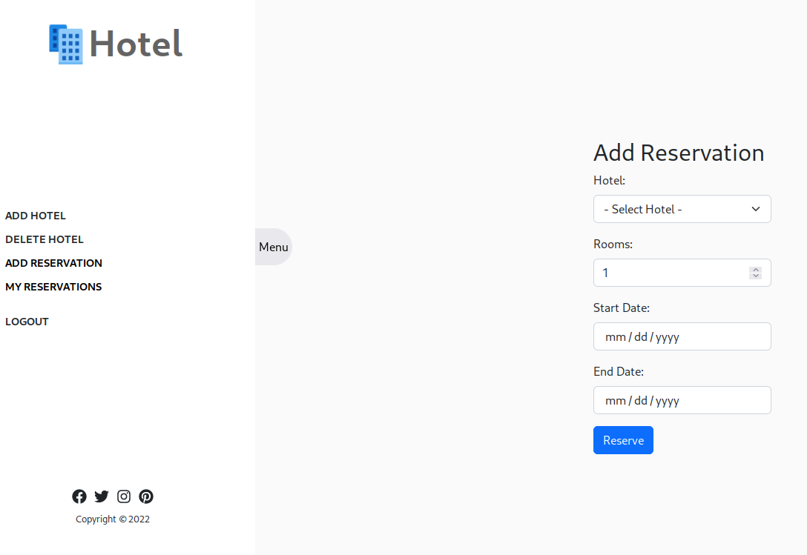
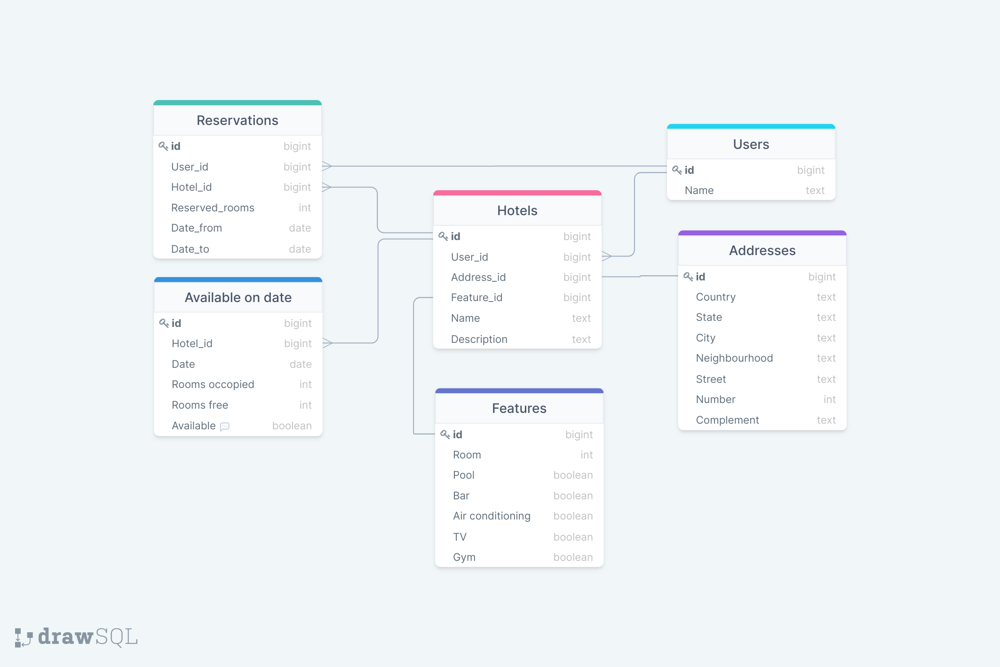

# Hotel Reservations

> Hotel Reservations is a project made by our 4-member group to give users options of hotels around the world to reserve with the options for the owners of these hotels to add and delete these hotels. Users can create an account to be able to reserve one (or many) hotel rooms and also add their own hotels. Feel free to fork this project and modify it for your own use!












## Deployment

You can find the app live [here](https://cryptic-lake-58741.herokuapp.com/)

## Front-end repository

You can find the front-end code [here](https://github.com/iKuartz/final-react)

## Back-end deployment repository

You can find the back-end code [here](https://github.com/iKuartz/final-rails)

You can find the deployed back-end API [here live](https://rails-hotels-api.herokuapp.com/).

## Built With

- **JavaScript**
- **Bootstrap**
- **React 18.2**
- **Redux Toolkit 1.8.1**
- **React-Redux 8.0.1**
- **Ruby 3.1.2**
- **Rails 7**
- **PostgreSQL**
- **Visual Studio Code**


## Getting Started

### To launch the project locally:

#### Step 1:

- Clone this repo locally using either github desktop or using the clone link provided by the green button on the top right.

- Alternatively, you can just download the complete zip file and extract the folder in your directory

#### Step 2:

- Download all dependencies to use the Project

```bash
> yarn start
or 
> npm start`
```

#### Step 3:

In the project directory, you can run:

```bash
> bundle install
> rails s
```
then open another terminal and type
```bash
> yarn start
or 
> npm start`
```
## Authors

👤 **Ivan Silva**
- GitHub: [@iKuartz](https://github.com/iKuartz)
- LinkedIn: [Ivan Barbosa da Silva](https://www.linkedin.com/in/i-b-silva/)

👤 **Saadat Ali**

- GitHub: [@githubhandle](https://github.com/Saadat123456)
- Twitter: [@twitterhandle](https://twitter.com/Saadat02021999)
- LinkedIn: [LinkedIn](https://www.linkedin.com/in/saadatali1999/)

👤 **Fabrizio Garcia**

- GitHub: [@fabgrel10](https://github.com/fabgrel10)
- Twitter: [@fabgrel10](https://twitter.com/fabgrel10)
- LinkedIn [@fabgrel10](https://www.linkedin.com/in/fabgrel10/)

👤 **Lisandro Seia**

 - GitHub: [@lisandroseia](https://github.com/lisandroseia)
 - Linkedin [LinkedIn](https://www.linkedin.com/in/lisandro-seia-295120225/)

## 🤝 Contributing

Contributions, issues, and feature requests are welcome and highly encouraged!
We feel that your input is what helps us grow so you're always welcome :)

Feel free to check the [issues page](../../issues/).

## Acknowledgments

- Thank you to all our peers who helped us out through this wonderful journey at Microverse. 🌥️
- The creator of the design guidelines [Murat Korkmaz](https://www.behance.net/muratk) on Behance.

## Show your support

Give us a ⭐️ if you like this project!

## 📝 License

This project is [MIT](./MIT.md) licensed.
